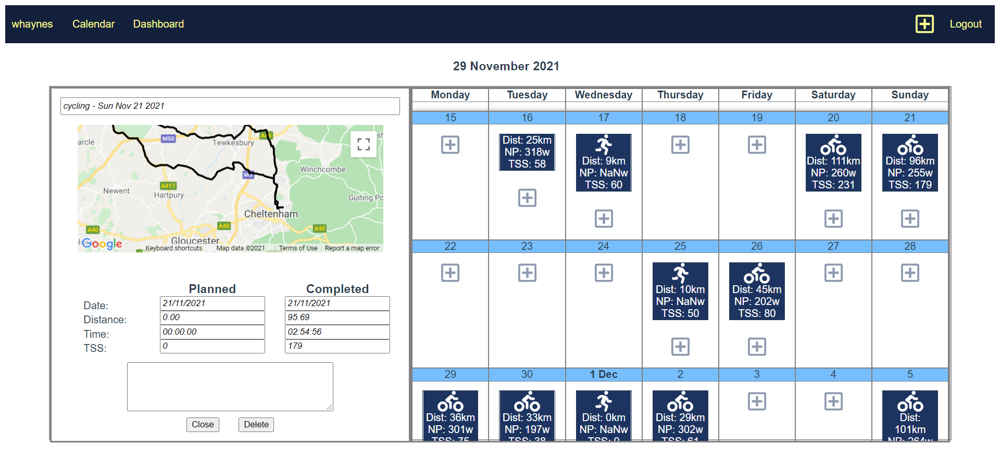
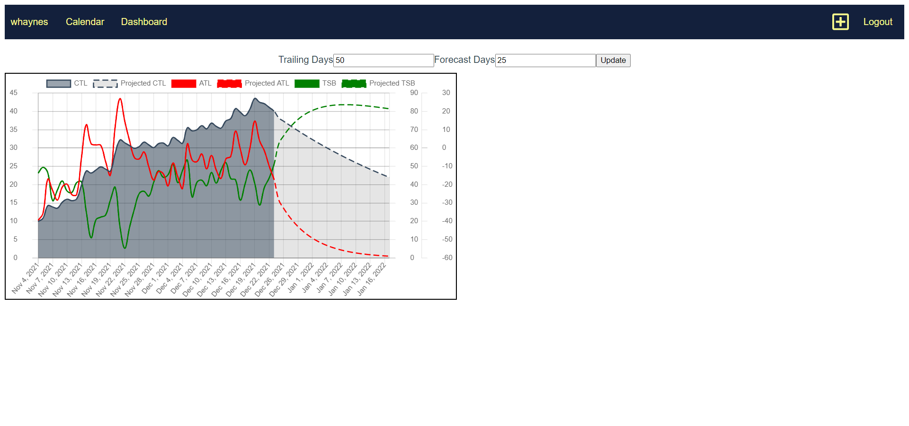

# Personal Project - Fitness tracking/planning app

This is a personal project I've been working on with the aim of replicating functionality of Training Peaks (https://app.trainingpeaks.com/). It is an ongoing project that I plan to continue building out.

## Table of contents

- [Overview](#overview)
  - [Screenshot](#screenshot)
  - [Links](#links)
- [My process](#my-process)
  - [Built with](#built-with)
  - [What I learned](#what-i-learned)
  - [Continued development](#continued-development)
  - [Useful resources](#useful-resources)
- [Author](#author)

## Overview
The app allows a user to sign up and create an account. Once logged in you can upload .fit files from a suitable device. The app will process the data and render the ride at the appropriate point in the calendar screen, calculating Normalised Power and Training Stress Score. From there you can click on activities to get some more detailed information, including a map of your route via the Google Maps API. I've only tested with power-enabled cycling files (as that's all I need for myself). You can also upload manual activities (a run or a bike ride), which depending on if they're in the future or not will show up as a planned activity or a completed activity. You can upload over a planned activity with the file upload.

Currently the Dashboard page has a chart that plots training stresses in the same way as the Performance Management Chart on Training Peaks. I plan to add more charts, but this was the main one I wanted.

Other plans for the page include better scrutiny of single ride data such as peak powers and lap analysis. I would also like an auto upload functionality, but this will involve scraping from Garmin Connect as there's no other way to get the raw .fit files without subbing to their $$$ API. Longterm I need to set up automated testing as that's something I've not touched yet.

### Screenshots 

### Links

- Live URL: (https://rides.trainingappserver.uk/#/)

### Built with

- Vue.js
- Node (Express)

### my-process

This has been a learning process for me so I've just focused on getting something usable and taking it step by step. It's far from perfect but hosting it costs $7 /month versus $20 /month for a Premium subscription to Training Peaks, plus I'm learning something so overall if it does what I need I'm happy. Overall it's taken about 3 months to get to this point from zero framework knowledge and a general full stack course from Udemy for the Node bits. I've worked on it a couple of hours in the evenings after my (non-dev) job.

### What I learned

I've used this project to get started in a frontend framework, namely Vue.js. The big things I've learned (or at least got started in) I would say are user authentication (hashed password + salt), user session management with Passport.js, state management and the basics of building the forntend with components.

I've also learnt a lot about deploying and hosting a page. The backend is hosted on Heroku and the frontend on GitHub pages, both connected to the custom domain name (trainingappserver.uk). 

### Useful resources

- fit.js package for parsing fit files
- chart.js package for charting
- this bash script for deploying the front end https://dev.to/tiim/how-i-use-vue-js-on-github-pages-45np

## Author

- Website - [William Haynes](https://willrhyd.github.io/personal/)

